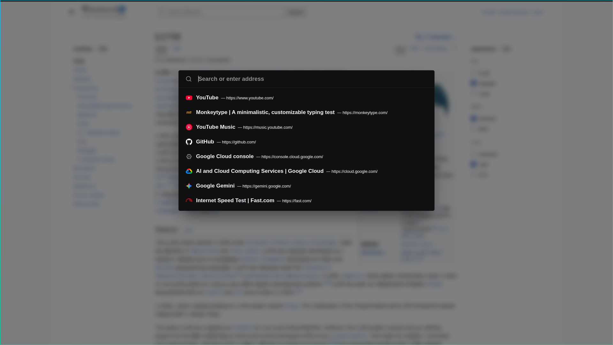
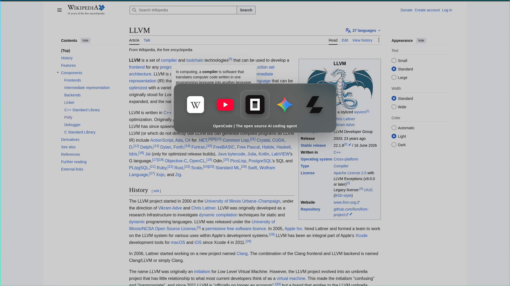
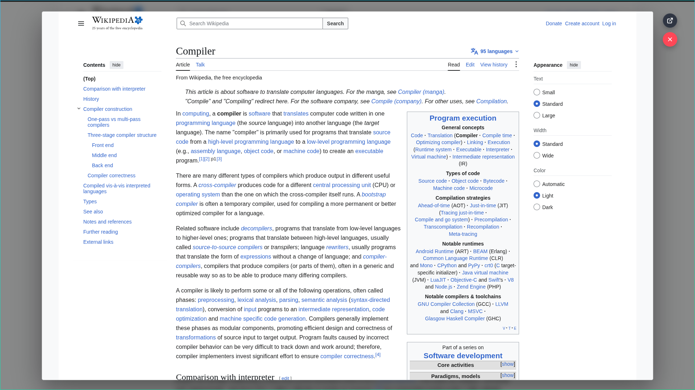

<div align="center">
  
</div>

<p align="center">
  A keyboard-first toolset for faster browsing <strong>search</strong>, <strong>switch</strong>, and <strong>preview</strong> without leaving your flow.
</p>

---

## Keyboard Shortcuts

| Shortcut | Action | Context |
|----------|--------|---------|
| `Ctrl/Cmd + Shift + K` | Open Spotlight search | Any website |
| `Ctrl/Cmd + Space` | Open Tab Switcher | Any website |
| `Alt + Click` | Open link preview (Glance) | Any website |
| `Escape` | Close active overlay | Any website |
| `Ctrl + /` | Open Spotlight search | New tab page |

---

## Features

### Spotlight Search
Instant history search with smart autocompletion. Type to find and navigate to sites from your browsing history, or search the web using your preferred search engine.

- History search with domain autocomplete
- Tab key to complete suggested domain names
- Search engine selector (Google, DuckDuckGo, Brave, Bing, Unduck)
- `Ctrl+Enter` to open first result in a new tab
- Favicon loading with caching and high-resolution fallback



### Tab Switcher
Visually switch between open tabs using the keyboard. A dock appears in the center of the screen showing tab favicons and page titles.

- Hold Ctrl/Cmd and press Space to cycle forward
- Add Shift to cycle in reverse
- Hover with mouse or keep pressing Space to navigate
- Release Ctrl/Cmd or click to confirm selection
- High-resolution favicon loading with local caching



### Glance
Preview links in an overlay without leaving the current page. Alt+Click any link to open it in an iframe modal.

- Inline iframe preview with full page rendering
- Open in new tab button within the preview
- Close with Escape or click outside the iframe
- X-Frame-Options and CSP headers are stripped via declarativeNetRequest for compatibility




---

## Installation

### Requirements

- [Bun](https://bun.sh/) 1.2.8 or higher
- Chromium-based browser (Chrome, Brave, Edge)

### Setup

```bash
git clone https://github.com/Rajeshpatel07/scythe.git
cd scythe
bun install
bun run build
```

Build output is written to the `dist/` folder.

### Load in Browser

1. Open `chrome://extensions`.
2. Enable Developer mode
3. Click "Load unpacked"
4. Select the `dist/` directory

---

## Customization

To disable the custom new tab page, remove this block from `manifest.json` and `build` extension again:

```json
"chrome_url_overrides": {
  "newtab": "index.html"
}
```

---

## Contributing

Contributions are welcome. Open an issue for bugs or feature requests.

1. Fork the repository
2. Create a feature branch: `git checkout -b feature/my-feature`
3. Commit your changes
4. Push to your fork
5. Open a pull request
