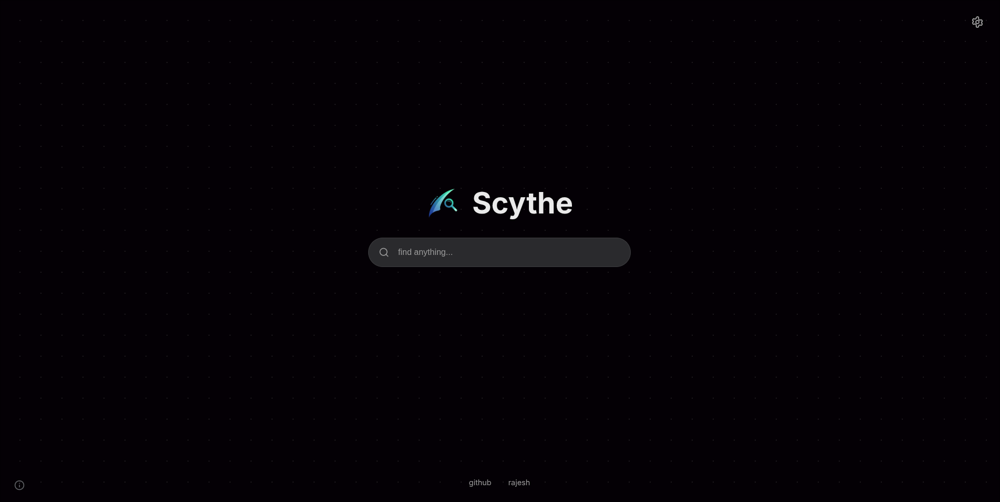

<div align="center">
  

</div>

<p align="center">
  A beautiful and keyboard based search panel for your browser,<br>

</p>

---
### 🎹 Keyboard Shortcuts

#### 🌐 On Any Website
- `Ctrl + Shift + K` → Launch **Spotlight** on websites

#### 🆕 On New Tab Page
- `Ctrl + /` → Launch **Spotlight** on new tab


## ✨ Features

- ✅ **Instant History Search**: Immediately find and navigate to sites from your browsing history.
- ✅ **Smart Autocompletion**: Get automatic domain name suggestions as you type and complete them with a press of the Tab key.
- ✅ **New Tab Homepage**: Replaces the default new tab page with the elegant Spotlight interface, complete with a settings panel to customize your experience.  

  
- ✅ **In-Website Modal**: Activate the Spotlight search from any webpage using a keyboard shortcut for quick access without leaving your current page.  

  

---

## 🐛 Bugs / To-Do

- [ ] **Firefox Support**: Add support for Firefox (currently only works in Chromium-based browsers).
- <del>[ ] **Fix CSS Conflicts**: On some websites, the page's native CSS can interfere with the Spotlight modal's styling.</del>
- <del> [ ] **Pathname Autocompletion**: Currently only domain names are suggested. Extend to include full paths (e.g., `github.com/user/repo`).</del>
- <del> [ ] **Optimized History Filtering**: Improve performance when filtering very large history databases.</del>
- <del> [ ] **Optimize Favicons**: Improve the speed of favicon display by leveraging caching mechanisms or retrieving them from local browsing history when available.</del>

---

## 🚀 Installation

### Requirements

- [Bun](https://bun.sh/): Version `1.2.8` or higher.
- **Browser**: A Chromium-based browser like Chrome, Brave, or Edge.

### Setup

Clone the project:

```bash
    git clone https://github.com/Rajeshpatel07/spotlight.git
    cd spotlight
```

Install dependencies:

```bash
    bun install
```
Build the project:

```bash
    bun run build
```
This will generate a `dist/` folder containing the extension files.

### Add to Browser
- Open your browser and go to: chrome://extensions or brave://extensions
- Enable Developer mode (top-right corner).
- Click Load unpacked.
- Select the `dist/` folder inside the project.
- follow this link [Add custom extension](https://developer.chrome.com/docs/extensions/get-started/tutorial/hello-world#load-unpacked)


## Customize

- By default the extension will show it's custom `new tab` page.
- If you want to remove this behaviour open `manifest.json` file and remove the below lines in the file.

```json
  "chrome_url_overrides": {
    "newtab": "index.html"
  },
```

## 🤝 Contributing
Contributions are always welcome!
- If you find any bug/issue or what to add feature please create a issue on it.

To contribute:
- Fork the repository

- Create a new feature branch

```bash
    git checkout -b feature/AmazingFeature
```
- Commit your changes

```bash
    git commit -m 'Add some AmazingFeature'
```
- Push to GitHub

```bash
    git push origin feature/AmazingFeature
```
Open a pull request
